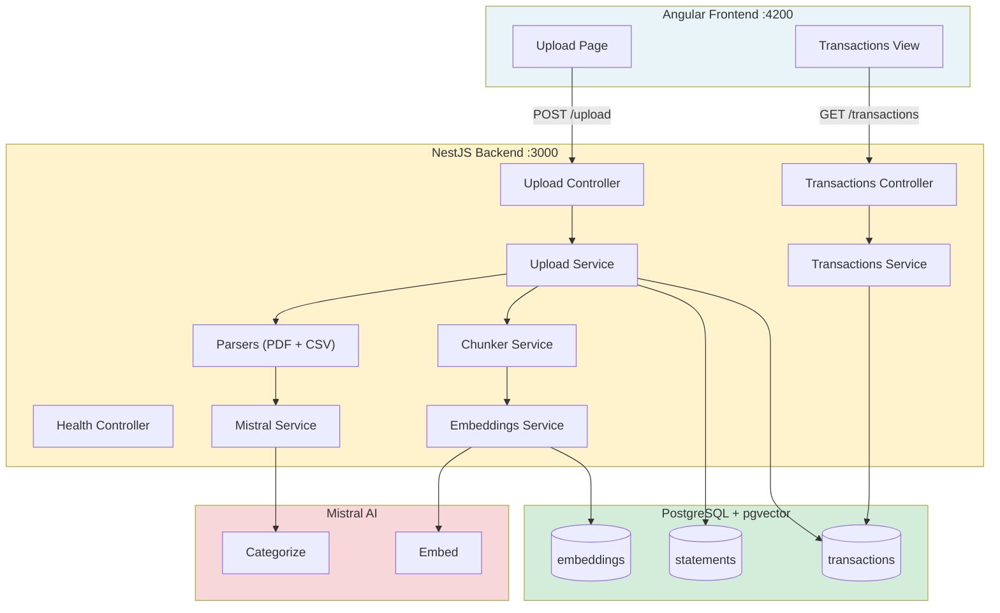

<p align="center">
  <h1 align="center">Ledger</h1>
  <p align="center"><strong>Your financial ledger. Ask anything.</strong></p>
  <p align="center">Upload bank statements, auto-parse transactions, and chat with your financial data using AI.</p>
</p>

<p align="center">
  
  
  
  
</p>

<p align="center">
  
  
  
  
  
  
</p>

---

## The Problem

Bank statements sit in downloads folders as PDFs and CSVs. Understanding spending patterns means manual spreadsheet work. Searching for a specific transaction means scrolling through pages of data.

## How Ledger Solves It

1. **Upload** -- Drag and drop any bank statement (PDF or CSV)
2. **Parse** -- Transactions are automatically extracted and categorized by AI
3. **Embed** -- Statement content is chunked and vectorized for semantic search
4. **Ask** -- Chat with your financial data in natural language
5. **Visualize** -- See spending patterns on interactive dashboards _(coming soon)_

## Features

| Feature             | Status             | Description                                          |
| ------------------- | ------------------ | ---------------------------------------------------- |
| Statement Upload    | :white_check_mark: | Drag-and-drop PDF/CSV with multi-bank support        |
| Transaction Parsing | :white_check_mark: | Extensible parser strategy (PDF + CSV heuristics)    |
| AI Categorization   | :white_check_mark: | Mistral-powered batch categorization of transactions |
| Vector Embeddings   | :white_check_mark: | pgvector storage with cosine similarity search       |
| RAG Chat            | :white_check_mark: | Natural language Q&A over your financial data        |
| Dashboard           | :construction:     | Visual analytics and spending breakdowns             |
| Auth & Polish       | :construction:     | User accounts and production hardening               |

## Architecture



## Quick Start

```bash
# Clone and install
git clone git@github.com:darth-dodo/ledger.git
cd ledger && pnpm install

# Start PostgreSQL (with pgvector)
docker compose up -d

# Configure environment
cp backend/.env.example backend/.env
# Add your MISTRAL_API_KEY to backend/.env

# Start backend (port 3000)
cd backend && pnpm dev

# Start frontend (port 4200)
cd frontend && pnpm dev
```

## Development

```bash
# Run all tests (302 tests)
make test

# Run with coverage
make test-coverage                     # Backend + frontend coverage

# Individual test suites
cd backend && pnpm test                # 246 backend tests
cd frontend && pnpm test               # 56 frontend tests (with coverage)

# Type check
cd backend && pnpm build

# Database migrations
cd backend && pnpm migrate             # Run pending migrations
cd backend && pnpm migration:revert    # Revert last migration
```

### Coverage

| Module   | Statements | Branches | Functions | Lines  |
| -------- | ---------- | -------- | --------- | ------ |
| Backend  | 96.46%     | 91.01%   | 100%      | 96.46% |
| Frontend | 95.02%     | 92.38%   | 87.5%     | 96.71% |

Coverage is enforced in CI and thresholds are set at 85% for the backend (`backend/vitest.config.ts`).

## Tech Stack

| Layer    | Technology                          | Purpose                                  |
| -------- | ----------------------------------- | ---------------------------------------- |
| Frontend | Angular 19, Tailwind CSS 4, daisyUI | SPA with standalone components           |
| Backend  | NestJS 11, TypeORM                  | REST API with dependency injection       |
| Database | PostgreSQL + pgvector               | Relational data + vector embeddings      |
| AI       | Mistral AI                          | Transaction categorization + embeddings  |
| Testing  | Vitest                              | Unit + integration tests (302 total)     |
| Runtime  | tsx, pnpm                           | TypeScript execution, package management |

## Project Structure

```
ledger/
├── backend/                # NestJS API (port 3000)
│   └── src/
│       ├── upload/         # POST /upload, GET/DELETE /statements
│       ├── transactions/   # GET /transactions, PATCH /transactions/:id
│       ├── embeddings/     # Chunking + vector embedding pipeline
│       ├── mistral/        # Mistral AI client (categorize + embed)
│       ├── health/         # GET /health
│       └── db/             # Migrations and data source config
├── frontend/               # Angular SPA (port 4200)
│   └── src/app/
│       ├── core/           # Services (ApiService)
│       ├── shared/         # Reusable components (FileDropzone)
│       └── features/       # Page components (Upload)
├── docs/
│   ├── product.md          # Product spec
│   ├── architecture.md     # System design
│   ├── adrs/               # Architecture decision records
│   └── milestones/         # Milestone docs and retros
└── docker-compose.yml      # PostgreSQL + pgvector
```

## Documentation

- [Product Spec](docs/product.md) -- Vision, features, and user stories
- [Architecture](docs/architecture.md) -- System design and data flow
- [ADR-001: Upload Strategy](docs/adrs/adr-001-upload-strategy.md) -- File handling decisions
- [ADR-002: Parser Strategy](docs/adrs/adr-002-parser-strategy.md) -- Multi-format parsing design
- [ADR-003: Embedding Strategy](docs/adrs/adr-003-embedding-strategy.md) -- RAG vector storage decisions
- [Changelog](CHANGELOG.md)
