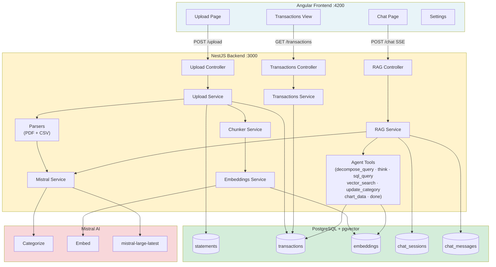
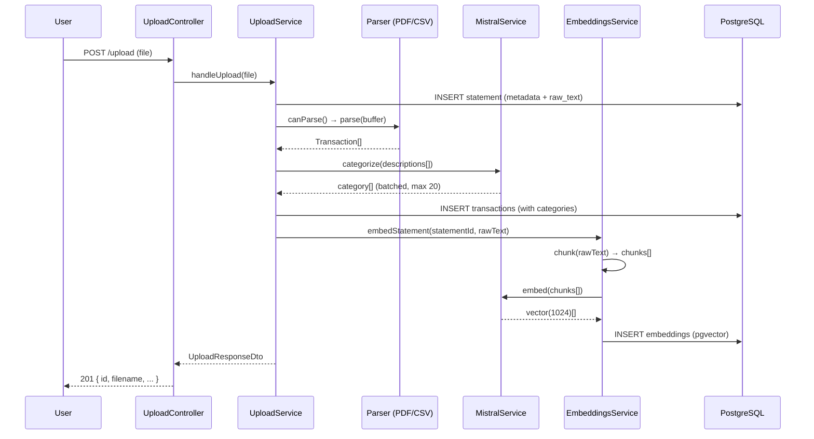
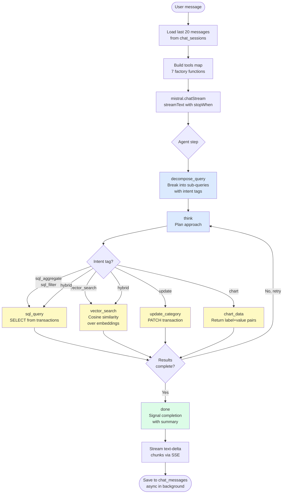
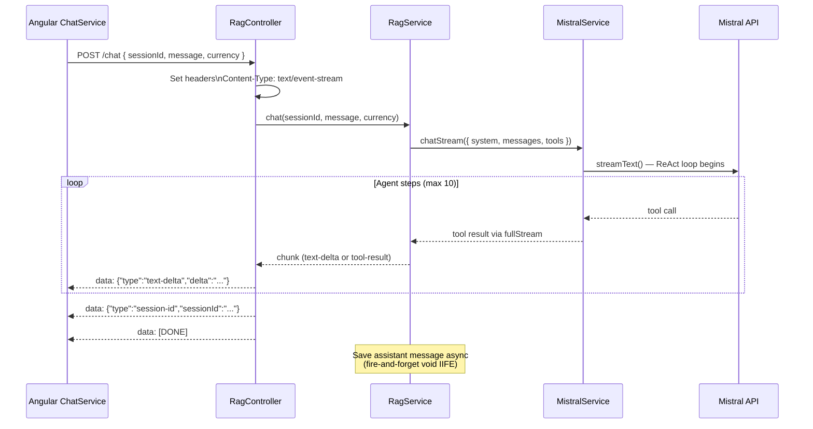
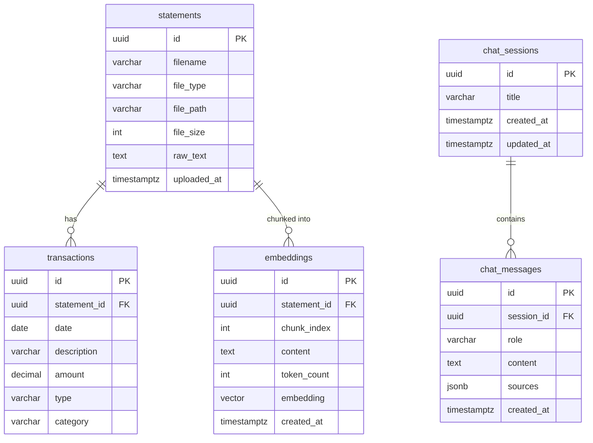

# Ledger — Codebase Summary

> Quick orientation for anyone picking up this codebase. For deeper detail see
> [architecture.md](architecture.md) and [product.md](product.md).

---

## What It Is

A full-stack financial data platform. Users upload bank statements (PDF/CSV),
which are parsed into transactions, categorized by AI, and vectorized for
semantic search. A conversational ReAct agent then answers natural language
questions over both SQL and vector indexes, streaming responses in real time.

**Stack**: NestJS 11 · Angular 21 · PostgreSQL + pgvector · Mistral AI ·
Vercel AI SDK v6
**Size**: 73 source files · 329 tests (275 backend / 54 frontend) · 5 database
tables · 12 API endpoints

---

## System Overview



---

## Upload Pipeline



---

## ReAct Agent Loop



---

## SSE Streaming Flow



---

## Database Schema



---

## Repository Layout

```
ledger/
├── backend/                  # NestJS API (port 3000)
│   └── src/
│       ├── app.module.ts     # Root module wiring
│       ├── upload/           # File ingestion pipeline
│       ├── transactions/     # Transaction queries and updates
│       ├── embeddings/       # Text chunking + pgvector storage
│       ├── mistral/          # AI SDK wrapper (categorize, embed, stream)
│       ├── rag/              # ReAct chat agent + 7 tools
│       ├── health/           # GET /health
│       └── db/               # TypeORM migrations and data source
├── frontend/                 # Angular 21 SPA (port 4200)
│   └── src/app/
│       ├── core/             # Services (Chat, Api, Transactions, Settings)
│       ├── shared/           # Pipes (Markdown), Components (FileDropzone)
│       └── features/         # Pages: Upload, Transactions, Chat, Settings
├── docs/                     # Architecture, product, ADRs, plans, milestones
└── docker-compose.yml        # PostgreSQL + pgvector
```

---

## Backend Modules

### `upload/`

Handles file ingestion end-to-end.

- **`upload.controller.ts`** — `POST /upload`, `GET /statements`,
  `DELETE /statements/:id`, `DELETE /purge`
- **`upload.service.ts`** — Streams file to disk, selects parser, calls Mistral
  for categorization, triggers embedding pipeline
- **`parsers/parser.interface.ts`** — Strategy interface: `canParse()` +
  `parse()`
- **`parsers/pdf.parser.ts`** — `pdf-parse` extraction, heuristic transaction
  detection
- **`parsers/csv.parser.ts`** — `csv-parse`, auto-detects date/amount/description
  columns
- **`entities/statement.entity.ts`** — Uploaded file metadata + raw text

Parsers are registered as a NestJS multi-provider token (`PARSERS`). The service
iterates them calling `canParse()` until one claims the file.

---

### `transactions/`

Thin query layer over the transactions table.

- **`transactions.controller.ts`** — `GET /transactions` (with filters),
  `PATCH /transactions/:id`
- **`transactions.service.ts`** — TypeORM query builder with date range,
  category, amount, type filters
- **`entities/transaction.entity.ts`** — date, description, amount, type,
  category; FK → statements

---

### `embeddings/`

Vector search pipeline for semantic queries.

- **`embeddings.service.ts`** — Calls Mistral embed API, stores 1024-dim
  vectors via pgvector, cosine similarity search
- **`chunker.service.ts`** — Splits raw statement text into overlapping segments
  with token counting
- **`entities/embedding.entity.ts`** — Chunk content + `vector(1024)` column;
  IVFFlat indexed

---

### `mistral/`

Single service wrapping two Mistral clients.

- **`mistral.service.ts`**
  - `categorize(descriptions[])` — Batch categorize via `@mistralai/mistralai`
    SDK; handles JSON response variants; batches at 20
  - `chatStream(params)` — Vercel AI SDK `streamText()` with tool-calling loop
  - `decomposeQuery(message)` — `generateObject()` with Zod schema; classifies
    intent as `sql_aggregate | sql_filter | vector_search | hybrid`

Requires `MISTRAL_API_KEY`. Degrades gracefully if not set (categorization
skipped, chat throws).

---

### `rag/`

The agentic chat system. Largest module.

- **`rag.controller.ts`** — `POST /chat` (SSE stream), `GET /chat/sessions`,
  `GET /chat/sessions/:id/messages`, `DELETE /chat/sessions/:id`
- **`rag.service.ts`** — Session management, conversation history (last 20
  messages), tool wiring, calls `mistral.chatStream()`, saves response async
- **`entities/chat-session.entity.ts`** — UUID, title (auto from first message),
  timestamps
- **`entities/chat-message.entity.ts`** — UUID, session FK, role, content,
  sources (JSONB)

#### Agent Tools (Tool Factory Pattern)

All in `rag/tools/`. Each is a factory function accepting injected
dependencies, returning a Vercel AI SDK `tool()` with a Zod `inputSchema`.

| Tool              | Factory                                     | Purpose                                         |
| ----------------- | ------------------------------------------- | ----------------------------------------------- |
| `decompose_query` | `createDecomposeQueryTool(mistralService)`  | Split compound questions into typed sub-queries |
| `think`           | `createThinkTool()`                         | Internal reasoning step, echoes thought         |
| `sql_query`       | `createSqlQueryTool(dataSource)`            | Safe SELECT-only SQL against transactions       |
| `vector_search`   | `createVectorSearchTool(embeddingsService)` | Cosine similarity search                        |
| `update_category` | `createUpdateCategoryTool(dataSource)`      | Re-categorize a transaction by ID               |
| `chart_data`      | `createChartDataTool(dataSource)`           | Returns `{ label, value }[]` for charts         |
| `done`            | `createDoneTool()`                          | Signals agent completion with summary text      |

**Stop conditions**: `hasToolCall('done')` or `stepCountIs(10)`

---

### `db/`

TypeORM migrations only. No runtime module.

| Migration                     | Creates                                    |
| ----------------------------- | ------------------------------------------ |
| `1709700000000-InitialSchema` | `statements`, `transactions`, `embeddings` |
| `1709700000001-AddChatTables` | `chat_sessions`, `chat_messages`           |

Run via `pnpm migrate` (backend).

---

## API Endpoints

| Method   | Path                          | Purpose                                                      |
| -------- | ----------------------------- | ------------------------------------------------------------ |
| `POST`   | `/upload`                     | Upload + parse statement, trigger categorization + embedding |
| `GET`    | `/statements`                 | List uploaded statements                                     |
| `GET`    | `/statements/:id`             | Get statement with raw text                                  |
| `DELETE` | `/statements/:id`             | Delete statement and cascaded data                           |
| `DELETE` | `/purge`                      | Clear all data                                               |
| `GET`    | `/transactions`               | Filtered transaction list                                    |
| `PATCH`  | `/transactions/:id`           | Update category or description                               |
| `POST`   | `/chat`                       | SSE streaming ReAct agent chat                               |
| `GET`    | `/chat/sessions`              | List chat sessions                                           |
| `GET`    | `/chat/sessions/:id/messages` | Get conversation history                                     |
| `DELETE` | `/chat/sessions/:id`          | Delete session and messages                                  |
| `GET`    | `/health`                     | Service health check                                         |

### SSE Stream Format (`POST /chat`)

```
data: {"type":"session-id","sessionId":"<uuid>"}
data: {"type":"text-delta","delta":"Hello"}
data: {"type":"text-delta","delta":", world"}
data: [DONE]
```

Session ID is always first. Text deltas may include tool result summaries
(extracted from `done` tool output when `streamResult.text` is empty).

---

## Frontend

### Routes

| Path            | Component               | Purpose                              |
| --------------- | ----------------------- | ------------------------------------ |
| `/upload`       | `UploadComponent`       | Drag-and-drop upload, statement list |
| `/transactions` | `TransactionsComponent` | Filterable transaction table         |
| `/chat`         | `ChatComponent`         | Streaming chat with session sidebar  |
| `/settings`     | `SettingsComponent`     | Currency preference                  |

All routes are lazy-loaded standalone components (no NgModules).

### Core Services

- **`ChatService`** — `sendMessage()` returns `Observable<string>`, parses SSE
  `data:` lines, emits text deltas and `__SESSION_ID__:<uuid>` prefixed strings
- **`TransactionsService`** — GET/PATCH wrappers
- **`SettingsService`** — Currency stored in `localStorage`; default `USD`
- **`ApiService`** — Base HTTP client

### Shared

- **`MarkdownPipe`** — `marked` library; renders AI response text as HTML for
  display in chat
- **`FileDropzoneComponent`** — Reusable drag-and-drop with file validation

---

## Key Patterns

### Tool Factory Pattern

```ts
// Each tool is a closure over its injected dependency
const tools = {
  sql_query: createSqlQueryTool(this.dataSource),
  vector_search: createVectorSearchTool(this.embeddingsService),
  decompose_query: createDecomposeQueryTool(this.mistralService),
  // ...
};
```

This keeps tools stateless and easily testable in isolation — unit tests mock
only the injected dep, not the whole NestJS container.

### Parser Strategy Pattern

```ts
// Parsers registered via multi-provider
{ provide: 'PARSERS', useClass: PdfParser, multi: true },
{ provide: 'PARSERS', useClass: CsvParser, multi: true },

// Service iterates:
const parser = this.parsers.find(p => p.canParse(buffer, filename));
```

Adding a new format = implement `ParserInterface`, register in `upload.module.ts`.

### SSE Streaming (Vercel AI SDK v6)

The controller iterates `streamResult.fullStream` manually (not
`pipeUIMessageStreamToResponse()` which was deprecated in v6). This gives
access to both text chunks and tool results in the same loop:

```ts
for await (const chunk of streamResult.fullStream) {
  if (chunk.type === 'text-delta') res.write(`data: ...`);
  if (chunk.type === 'tool-result' && chunk.toolName === 'done') { ... }
}
```

### Background Persistence

The assistant response is saved to `chat_messages` asynchronously after the
stream completes, via a fire-and-forget `void (async () => { ... })()`. This
avoids blocking the SSE response while the full text is assembled.

---

## Testing

| Suite    | Files | Tests | Coverage                                       |
| -------- | ----- | ----- | ---------------------------------------------- |
| Backend  | 24    | 275   | 96% statements · 91% branches · 100% functions |
| Frontend | 7     | 54    | 94% statements · 90% branches                  |

All tests use **Vitest**. Backend uses `@nestjs/testing` for controller/service
tests and `supertest` for HTTP integration tests. Frontend uses `jsdom`.

Coverage thresholds enforced in CI at 85% (backend `vitest.config.ts`).

---

## Environment Variables

| Variable          | Required                 | Purpose                              |
| ----------------- | ------------------------ | ------------------------------------ |
| `DATABASE_URL`    | Yes                      | PostgreSQL connection string         |
| `MISTRAL_API_KEY` | Yes (for AI features)    | Mistral API auth; omit to disable AI |
| `PORT`            | No (default 3000)        | Backend listen port                  |
| `UPLOAD_DIR`      | No (default `./uploads`) | File storage path                    |

---

## Running Locally

```bash
# 1. Start PostgreSQL with pgvector
docker compose up -d

# 2. Install deps
pnpm install

# 3. Configure
cp backend/.env.example backend/.env
# Add MISTRAL_API_KEY to backend/.env

# 4. Run migrations
cd backend && pnpm migrate

# 5. Start backend (port 3000)
cd backend && pnpm dev

# 6. Start frontend (port 4200)
cd frontend && pnpm dev
```

```bash
# Tests
cd backend && pnpm test      # 275 tests
cd frontend && pnpm test     # 54 tests with coverage

# Type check
cd backend && pnpm build
```
