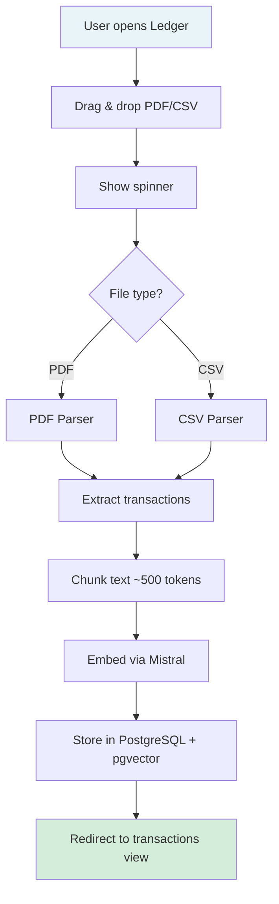
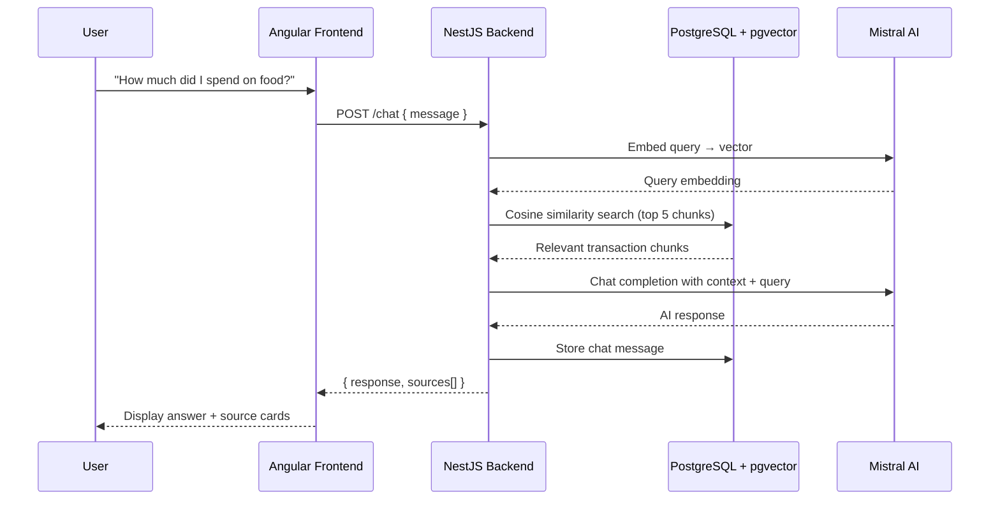
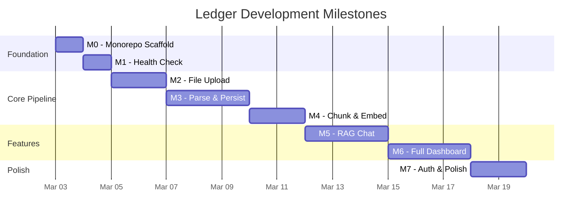

# Ledger — Product Document

### _Your financial ledger. Ask anything._

---

## 1. Vision

Ledger is a personal finance tool that lets you upload bank statements, automatically parse transactions, and interact with your financial data through natural language chat and visual analytics.

---

## 2. Target User

- **Who**: Individual tracking personal finances
- **Problem**: Bank statements are PDFs/CSVs that sit in downloads folders. Understanding spending patterns requires manual spreadsheet work.
- **Solution**: Upload statements → get structured data + AI-powered Q&A + visual dashboards instantly

---

## 3. Core Features

### MVP (M0–M5)

| Feature            | Description                                           | Priority |
| ------------------ | ----------------------------------------------------- | -------- |
| Statement Upload   | Drag-and-drop PDF/CSV upload with fire-and-forget UX  | P0       |
| Multi-Bank Parsing | Extensible parser strategy for various bank formats   | P0       |
| Transaction View   | Filterable, sortable table of parsed transactions     | P0       |
| RAG Chat           | Ask questions about your finances in natural language | P0       |
| Source Attribution | Show which transaction chunks informed each AI answer | P1       |

### Analytics (M6)

| Feature             | Description                                  | Priority |
| ------------------- | -------------------------------------------- | -------- |
| Spending Summary    | Total in/out, top categories, savings rate   | P0       |
| Category Breakdown  | Pie/bar chart of spending by category        | P0       |
| Monthly Trends      | Month-over-month line chart                  | P0       |
| Daily Heatmap       | Calendar heatmap of daily spending           | P1       |
| Recurring Detection | Identify subscriptions and recurring charges | P1       |
| Category Drill-Down | Click a category to see its transactions     | P1       |

### Polish (M7)

| Feature          | Description                              | Priority |
| ---------------- | ---------------------------------------- | -------- |
| Authentication   | JWT-based login/register                 | P2       |
| Category Editing | Fix AI-assigned categories manually      | P2       |
| Error Handling   | Consistent error states across all pages | P2       |

---

## 4. User Flows

### 4.1 Upload Flow



### 4.2 Chat Flow



### 4.3 Dashboard Flow

```mermaid
flowchart TD
    A[User opens Dashboard] --> B[Fetch analytics endpoints]
    B --> C[/analytics/summary]
    B --> D[/analytics/categories]
    B --> E[/analytics/monthly]
    B --> F[/analytics/daily]

    C --> G[Stat Cards<br/>Total Spent · Income · Savings Rate]
    D --> H[Category Breakdown<br/>Pie Chart + Bar Chart]
    E --> I[Monthly Trends<br/>Line Chart]
    F --> J[Daily Heatmap<br/>Calendar View]

    G --> K[Dashboard Page]
    H --> K
    I --> K
    J --> K

    style K fill:#d4edda
```

---

## 5. Chat Examples

| User Query                                      | Type     | Expected Behavior                         |
| ----------------------------------------------- | -------- | ----------------------------------------- |
| "How much did I spend on food in January?"      | Spending | Sum food transactions, cite specific ones |
| "What's my biggest expense this month?"         | Spending | Find max transaction, provide context     |
| "Am I spending more on Swiggy than last month?" | Pattern  | Compare across statement periods          |
| "What subscriptions am I paying for?"           | Pattern  | Identify recurring charges                |
| "What was that 12,000 charge last week?"        | Anomaly  | Find and explain specific transaction     |
| "Flag any unusual transactions"                 | Anomaly  | Identify outliers from spending patterns  |

---

## 6. Milestone Roadmap



---

## 7. Tech Stack

| Layer           | Technology                         | Purpose                                                  |
| --------------- | ---------------------------------- | -------------------------------------------------------- |
| Frontend        | Angular 19 (TypeScript)            | SPA with components, services, routing                   |
| Backend         | NestJS (TypeScript)                | REST API with modules, DI, decorators                    |
| Database        | PostgreSQL + pgvector              | Transactions + vector similarity search                  |
| AI              | Mistral AI                         | Embeddings (mistral-embed) + Chat (mistral-large-latest) |
| File Parsing    | pdf-parse, csv-parse               | Extract text from bank statements                        |
| Charts          | Chart.js / ngx-charts (planned M6) | Dashboard visualizations                                 |
| Package Manager | pnpm                               | Fast installs, strict dependency resolution              |
| Deployment      | Docker Compose (local)             | PostgreSQL + pgvector container                          |

---

## 8. Constraints & Decisions

| Decision          | Choice                | Rationale                                                                                           |
| ----------------- | --------------------- | --------------------------------------------------------------------------------------------------- |
| Chat architecture | RAG for everything    | Simpler pipeline. Can add SQL routing later if accuracy is an issue for aggregation queries.        |
| Upload UX         | Fire and forget       | MVP simplicity. No progress steps or background processing.                                         |
| Auth timing       | Deferred to M7        | No login friction during development. Single-user local app doesn't need auth early.                |
| Parser design     | Strategy pattern      | Bank PDF formats vary across institutions. Each bank gets its own parser. Start with one, add more. |
| Deployment        | Local Docker Compose  | No cloud until product is solid.                                                                    |
| Database          | PostgreSQL + pgvector | Single DB for both structured data and vector search. No separate vector DB needed.                 |
