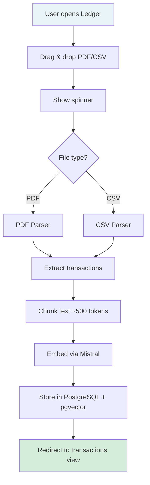
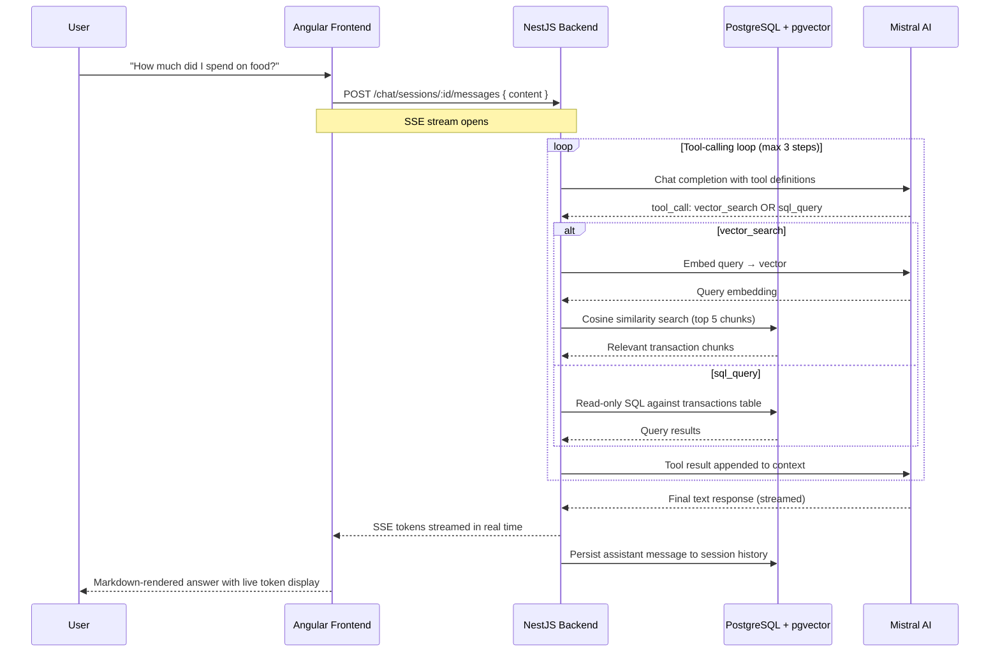
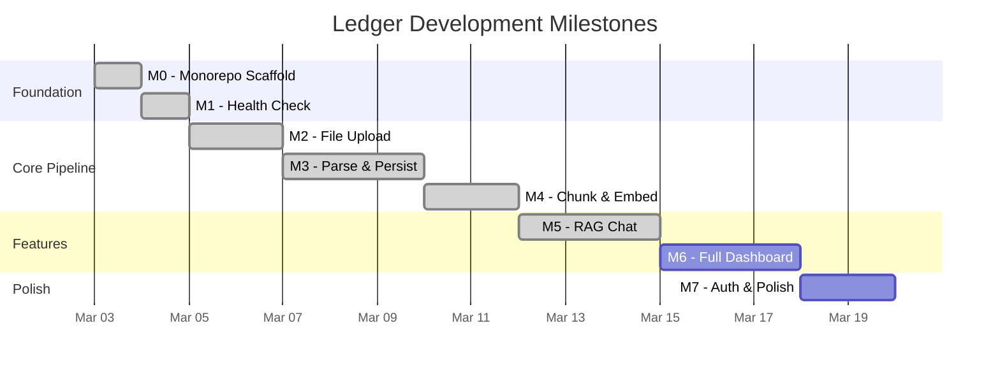

# Ledger — Product Document

### _Your financial ledger. Ask anything._

---

## 1. Vision

Ledger is a personal finance tool that lets you upload bank statements, automatically parse transactions, and interact with your financial data through natural language chat and visual analytics.

---

## Current Status

**M5 (RAG Chat) is complete.** The full upload-to-chat pipeline is functional: users can upload bank statements, view parsed transactions, and ask natural language questions about their finances. The chat system uses Mistral function calling with two tools (`vector_search` for semantic retrieval over statement chunks, `sql_query` for read-only aggregation queries against the transactions table), SSE streaming for real-time response display, and Markdown rendering. A settings page lets users select their currency, which persists in localStorage and formats monetary values in chat responses. Test coverage is at 96% (backend) and 95% (frontend) with 302 tests across both. Next milestone is M6 (Full Dashboard) for visual analytics.

---

## 2. Target User

- **Who**: Individual tracking personal finances
- **Problem**: Bank statements are PDFs/CSVs that sit in downloads folders. Understanding spending patterns requires manual spreadsheet work.
- **Solution**: Upload statements → get structured data + AI-powered Q&A + visual dashboards instantly

---

## 3. Core Features

### MVP (M0–M5) -- Complete

| Feature            | Description                                                               | Priority | Status |
| ------------------ | ------------------------------------------------------------------------- | -------- | ------ |
| Statement Upload   | Drag-and-drop PDF/CSV upload with fire-and-forget UX                      | P0       | Done   |
| Multi-Bank Parsing | Extensible parser strategy for various bank formats                       | P0       | Done   |
| Transaction View   | Filterable, sortable table of parsed transactions                         | P0       | Done   |
| RAG Chat           | Session-based chat with SSE streaming, tool calling (vector search + SQL) | P0       | Done   |
| Markdown Rendering | Chat responses rendered as Markdown with proper formatting                | P0       | Done   |
| Settings           | Currency selector persisted in localStorage, formats amounts in chat      | P1       | Done   |

### Analytics (M6)

| Feature             | Description                                  | Priority |
| ------------------- | -------------------------------------------- | -------- |
| Spending Summary    | Total in/out, top categories, savings rate   | P0       |
| Category Breakdown  | Pie/bar chart of spending by category        | P0       |
| Monthly Trends      | Month-over-month line chart                  | P0       |
| Daily Heatmap       | Calendar heatmap of daily spending           | P1       |
| Recurring Detection | Identify subscriptions and recurring charges | P1       |
| Category Drill-Down | Click a category to see its transactions     | P1       |

### Polish (M7)

| Feature          | Description                              | Priority |
| ---------------- | ---------------------------------------- | -------- |
| Authentication   | JWT-based login/register                 | P2       |
| Category Editing | Fix AI-assigned categories manually      | P2       |
| Error Handling   | Consistent error states across all pages | P2       |

---

## 4. User Flows

### 4.1 Upload Flow



### 4.2 Chat Flow



### 4.3 Dashboard Flow

```mermaid
flowchart TD
    A[User opens Dashboard] --> B[Fetch analytics endpoints]
    B --> C[/analytics/summary]
    B --> D[/analytics/categories]
    B --> E[/analytics/monthly]
    B --> F[/analytics/daily]

    C --> G[Stat Cards<br/>Total Spent · Income · Savings Rate]
    D --> H[Category Breakdown<br/>Pie Chart + Bar Chart]
    E --> I[Monthly Trends<br/>Line Chart]
    F --> J[Daily Heatmap<br/>Calendar View]

    G --> K[Dashboard Page]
    H --> K
    I --> K
    J --> K

    style K fill:#d4edda
```

---

## 5. Chat Examples

| User Query                                      | Type     | Expected Behavior                         |
| ----------------------------------------------- | -------- | ----------------------------------------- |
| "How much did I spend on food in January?"      | Spending | Sum food transactions, cite specific ones |
| "What's my biggest expense this month?"         | Spending | Find max transaction, provide context     |
| "Am I spending more on Swiggy than last month?" | Pattern  | Compare across statement periods          |
| "What subscriptions am I paying for?"           | Pattern  | Identify recurring charges                |
| "What was that 12,000 charge last week?"        | Anomaly  | Find and explain specific transaction     |
| "Flag any unusual transactions"                 | Anomaly  | Identify outliers from spending patterns  |

---

## 6. Milestone Roadmap

| Milestone | Name              | Status   | Key Deliverables                                                             |
| --------- | ----------------- | -------- | ---------------------------------------------------------------------------- |
| M0        | Monorepo Scaffold | Complete | pnpm workspace, NestJS + Angular, Docker Compose for PostgreSQL              |
| M1        | Health Check      | Complete | `/health` endpoint, CI pipeline, basic connectivity                          |
| M2        | File Upload       | Complete | Drag-and-drop upload, statement entity, file storage                         |
| M3        | Parse & Persist   | Complete | PDF/CSV parsers (strategy pattern), transactions table, Mistral categories   |
| M4        | Chunk & Embed     | Complete | Text chunking (~500 tokens), Mistral embeddings, pgvector storage            |
| M5        | RAG Chat          | Complete | Session-based chat, SSE streaming, vector_search + sql_query tools, settings |
| M6        | Full Dashboard    | Planned  | Spending summary, category breakdown, monthly trends, daily heatmap          |
| M7        | Auth & Polish     | Planned  | JWT auth, category editing, error handling                                   |



---

## 7. Tech Stack

| Layer           | Technology                               | Purpose                                                            |
| --------------- | ---------------------------------------- | ------------------------------------------------------------------ |
| Frontend        | Angular 19 (TypeScript)                  | SPA with components, services, routing                             |
| Backend         | NestJS (TypeScript)                      | REST API with modules, DI, decorators                              |
| Database        | PostgreSQL + pgvector                    | Transactions + vector similarity search                            |
| AI              | Mistral AI                               | Embeddings (mistral-embed) + Chat (mistral-large-latest)           |
| AI SDK          | Vercel AI SDK (`ai` + `@ai-sdk/mistral`) | Streaming chat completions, tool-calling loop, SSE transport       |
| File Parsing    | pdf-parse, csv-parse                     | Extract text from bank statements                                  |
| Markdown        | marked                                   | Render AI chat responses as formatted Markdown (via MarkdownPipe)  |
| Testing         | Vitest + @vitest/coverage-v8             | Unit/integration tests with V8 coverage (302 tests, 95%+ coverage) |
| Charts          | Chart.js / ngx-charts (planned M6)       | Dashboard visualizations                                           |
| Package Manager | pnpm                                     | Fast installs, strict dependency resolution                        |
| Deployment      | Docker Compose (local)                   | PostgreSQL + pgvector container                                    |

---

## 8. Constraints & Decisions

| Decision          | Choice                         | Rationale                                                                                                                                                               |
| ----------------- | ------------------------------ | ----------------------------------------------------------------------------------------------------------------------------------------------------------------------- |
| Chat architecture | Tool-calling with two tools    | Mistral function calling routes between `vector_search` (semantic) and `sql_query` (aggregation). Up to 3 tool calls per turn. Replaced the original RAG-only approach. |
| Streaming         | SSE via Vercel AI SDK          | Real-time token display gives responsive UX. SSE is simpler than WebSockets for unidirectional streaming.                                                               |
| Chat sessions     | Persistent session history     | Each chat session stores messages in PostgreSQL. Enables multi-turn context and conversation continuity.                                                                |
| Currency settings | localStorage + chat formatting | User picks currency once in settings; amounts in chat responses are formatted accordingly. No backend change needed.                                                    |
| Upload UX         | Fire and forget                | MVP simplicity. No progress steps or background processing.                                                                                                             |
| Auth timing       | Deferred to M7                 | No login friction during development. Single-user local app doesn't need auth early.                                                                                    |
| Parser design     | Strategy pattern               | Bank PDF formats vary across institutions. Each bank gets its own parser. Start with one, add more.                                                                     |
| Deployment        | Local Docker Compose           | No cloud until product is solid.                                                                                                                                        |
| Database          | PostgreSQL + pgvector          | Single DB for both structured data and vector search. No separate vector DB needed.                                                                                     |
