# Ledger — Project Board

> Persistent task tracker across sessions. Updated by each session's agent.

---

## Progress Dashboard

| Metric                | Value                   |
| --------------------- | ----------------------- |
| **Current Milestone** | M4 — Chunk & Embed ✅   |
| **Overall Progress**  | 5/8 milestones complete |
| **Active Blockers**   | 0                       |
| **Quality Gates**     | 6/8 passing (2 N/A)     |
| **Tests**             | 178                     |
| **Last Updated**      | 2026-03-06              |

---

## Milestone Matrix

| #   | Milestone         | Status | Pattern      | Personas                       | Duration | Depends On |
| --- | ----------------- | ------ | ------------ | ------------------------------ | -------- | ---------- |
| M0  | Monorepo Scaffold | ✅     | Single agent | Developer                      | 1d       | —          |
| M1  | Health Check      | ✅     | Single agent | Developer                      | 1d       | M0         |
| M2  | File Upload       | ✅     | Sequential   | Architect → Developer          | 1d       | M1         |
| M3  | Parse & Persist   | ✅     | Sequential   | Architect → Developer → QA     | 3d       | M2         |
| M4  | Chunk & Embed     | ✅     | Sequential   | Architect → Developer + AI     | 2d       | M3         |
| M5  | RAG Chat          | ⏳     | Hierarchical | Architect leads, Dev + AI      | 3d       | M4         |
| M6  | Full Dashboard    | ⏳     | Parallel     | Dev (backend) + Dev (frontend) | 3d       | M5         |
| M7  | Auth & Polish     | ⏳     | Parallel     | Dev + QA + Writer              | 2d       | M6         |

**Legend**: ✅ Complete | 🔄 In Progress | ⏳ Pending | 🚫 Blocked

---

## Dependency Graph

```mermaid
graph LR
    M0[M0: Scaffold] --> M1[M1: Health Check]
    M1 --> M2[M2: File Upload]
    M2 --> M3[M3: Parse & Persist]
    M3 --> M4[M4: Chunk & Embed]
    M4 --> M5[M5: RAG Chat]
    M5 --> M6[M6: Full Dashboard]
    M6 --> M7[M7: Auth & Polish]

    style M0 fill:#d4edda,stroke:#28a745
    style M1 fill:#d4edda,stroke:#28a745
    style M2 fill:#d4edda,stroke:#28a745
    style M3 fill:#d4edda,stroke:#28a745
    style M4 fill:#d4edda,stroke:#28a745
    style M5 fill:#f5f5f5,stroke:#999
    style M6 fill:#f5f5f5,stroke:#999
    style M7 fill:#f5f5f5,stroke:#999
```



---

## Per-Milestone Task Breakdown

### M0 — Monorepo Scaffold ✅

- [x] Initialize project with `package.json`
- [x] Configure `.gitignore` for NestJS + Angular
- [x] Set up GitHub Actions CI (lint, test, build)
- [x] Add placeholder scripts for CI compatibility
- [x] Add pre-commit hooks for code quality gates
- [x] Write product document (`docs/product.md`)
- [x] Write architecture document (`docs/architecture.md`)
- [x] Set up agentic framework with personas, workflows, quality gates
- [x] Create monorepo workspace structure (`backend/`, `frontend/`)
- [x] Add `tsconfig.json` (root + per-workspace)
- [x] Configure ESLint + Prettier
- [x] Scaffold NestJS backend (`backend/src/app.module.ts`)
- [x] Scaffold Angular frontend (`frontend/src/app/`)
- [x] Add `docker-compose.yml` for PostgreSQL + pgvector
- [x] Verify `pnpm install` + `pnpm run build` works end-to-end

**Acceptance Criteria**:

- [x] `pnpm install` succeeds in root
- [x] `pnpm run build` passes
- [x] `pnpm test` runs
- [x] CI passes on push
- [x] Both `backend/` and `frontend/` directories exist with starter code

---

### M1 — Health Check ✅

- [x] Create NestJS health module with `GET /health` endpoint
- [x] Return `{ status: "ok", timestamp, uptime }`
- [x] Add health check integration test (`pnpm test`)
- [x] Verify endpoint works with `curl`
- [x] Add smoke test to CI pipeline

**Acceptance Criteria**:

- [x] `curl http://localhost:3000/health` returns 200 with JSON
- [x] Integration test passes
- [x] CI green

---

### M2 — File Upload ✅

- [x] Design upload strategy (ADR-001)
- [x] Create Upload module (controller, service)
- [x] Implement `POST /upload` with Multer for file handling
- [x] Validate file type (PDF/CSV only) and size (< 10MB)
- [x] Store uploaded file metadata in `statements` table
- [x] Create `GET /statements` and `GET /statements/:id` endpoints
- [x] Create `DELETE /statements/:id` endpoint
- [x] Add Angular upload page with drag-and-drop `FileDropzone` component
- [x] Write unit tests for upload validation
- [x] Write integration test for full upload flow

**Acceptance Criteria**:

- [x] PDF and CSV files upload successfully
- [x] Invalid files are rejected with clear error
- [x] Statements are persisted in database
- [x] Frontend drag-and-drop works
- [x] Quality gates pass

---

### M3 — Parse & Persist ✅

- [x] Design parser strategy pattern (ADR)
- [x] Create `ParserInterface` with `canParse()` and `parse()` methods
- [x] Implement generic PDF parser (`pdf-parse`)
- [x] Implement generic CSV parser (`csv-parse`)
- [x] Extract transactions: date, description, amount, type
- [x] AI category assignment via Mistral
- [x] Store transactions in `transactions` table
- [x] Create `GET /transactions` with filters (date, category, amount)
- [x] Create `PATCH /transactions/:id` for category edits
- [x] Add Angular transactions view with filterable table
- [x] Write unit tests per parser (happy path + malformed input)
- [x] Write integration test for full parse pipeline
- [x] Test idempotency (re-upload same file)

**Acceptance Criteria**:

- [x] PDF and CSV statements produce correct transactions
- [x] Each transaction has: date, description, amount, type, category
- [x] Transactions are viewable and filterable in frontend
- [x] Duplicate uploads don't create duplicate records
- [x] Quality gates pass

---

### M4 — Chunk & Embed ✅

**Overlay**: ai-engineer

- [x] Design embedding strategy (ADR)
- [x] Implement `ChunkerService` (~500 token chunks with overlap)
- [x] Integrate Mistral Embed API (1024-dim vectors)
- [x] Store chunks + embeddings in `embeddings` table with pgvector
- [x] Create IVFFlat index for cosine similarity search
- [x] Wire chunking + embedding into upload pipeline (post-parse)
- [x] Write unit tests for chunker (boundary cases, overlap)
- [x] Write integration test: upload → parse → chunk → embed → verify vectors
- [x] Validate embedding dimensions = 1024

**Acceptance Criteria**:

- [x] Statement text is chunked into ~500 token segments
- [x] Each chunk has a 1024-dim embedding stored in pgvector
- [x] Cosine similarity search returns relevant chunks
- [x] Pipeline runs end-to-end on upload
- [x] Quality gates pass

---

### M5 — RAG Chat ⏳

**Overlay**: ai-engineer

- [ ] Design RAG pipeline (ADR)
- [ ] Create RAG module (controller, service)
- [ ] Implement query embedding (user question → vector)
- [ ] Implement vector similarity search (top 5 chunks)
- [ ] Build prompt template (system + context + query)
- [ ] Integrate Mistral Chat API for response generation
- [ ] Return response with source attribution (chunk IDs)
- [ ] Store chat messages in `chat_messages` table
- [ ] Create `GET /chat/history` endpoint
- [ ] Add Angular chat page (MessageInput, MessageBubble, SourceCard)
- [ ] Write integration test for full RAG pipeline
- [ ] Test with example queries from product doc

**Acceptance Criteria**:

- [ ] User can ask natural language questions about their finances
- [ ] Responses cite specific transactions/chunks as sources
- [ ] Chat history is persisted
- [ ] Source cards show which data informed each answer
- [ ] Quality gates pass

---

### M6 — Full Dashboard ⏳

**Track A — Backend API**:

- [ ] Create Analytics module (controller, service)
- [ ] `GET /analytics/summary` — total in/out, top categories, savings rate
- [ ] `GET /analytics/categories` — spending by category
- [ ] `GET /analytics/monthly` — month-over-month breakdown
- [ ] `GET /analytics/daily` — daily spending data for heatmap
- [ ] Write unit tests for analytics calculations

**Track B — Frontend Dashboard**:

- [ ] StatCards component (total spent, income, savings rate)
- [ ] CategoryBreakdown component (pie chart + bar chart)
- [ ] MonthlyTrends component (line chart)
- [ ] DailyHeatmap component (calendar view)
- [ ] Wire components to analytics API
- [ ] Responsive layout

**Acceptance Criteria**:

- [ ] Dashboard shows summary stats, category breakdown, trends, heatmap
- [ ] Charts render correctly with real transaction data
- [ ] Responsive on mobile and desktop
- [ ] Quality gates pass (including accessibility)

---

### M7 — Auth & Polish ⏳

**Track A — Authentication**:

- [ ] Implement JWT-based login/register
- [ ] Add auth guards to all endpoints
- [ ] Login/register pages in Angular

**Track B — Error Handling**:

- [ ] Consistent error states across all pages
- [ ] API error interceptor in Angular
- [ ] NestJS exception filters

**Track C — Documentation**:

- [ ] API documentation
- [ ] User guide
- [ ] Deployment guide

**Acceptance Criteria**:

- [ ] Users can register, login, and access their own data
- [ ] Errors are handled gracefully everywhere
- [ ] Documentation is complete
- [ ] All 8 quality gates pass

---

## Quality Gate Tracker

| Milestone | Syntax | Types | Lint | Security | Tests | Perf | A11y | Integration |
| --------- | ------ | ----- | ---- | -------- | ----- | ---- | ---- | ----------- |
| M0        | ✅     | ✅    | ✅   | ✅       | ✅    | ➖   | ➖   | ✅          |
| M1        | ✅     | ✅    | ✅   | ✅       | ✅    | ➖   | ➖   | ✅          |
| M2        | ✅     | ✅    | ✅   | ✅       | ✅    | ➖   | ➖   | ✅          |
| M3        | ✅     | ✅    | ✅   | ✅       | ✅    | ➖   | ➖   | ✅          |
| M4        | ✅     | ✅    | ✅   | ✅       | ✅    | ✅   | ➖   | ✅          |
| M5        | ⏳     | ⏳    | ⏳   | ⏳       | ⏳    | ⏳   | ⏳   | ⏳          |
| M6        | ⏳     | ⏳    | ⏳   | ⏳       | ⏳    | ⏳   | ⏳   | ⏳          |
| M7        | ⏳     | ⏳    | ⏳   | ⏳       | ⏳    | ⏳   | ⏳   | ⏳          |

**Legend**: ✅ Passed | ❌ Failed | ⚠️ Warning | ⏳ Pending | ➖ N/A

**Commands**:

```bash
pnpm run build                   # Gates 1+2 (tsc --noEmit)
pnpm run lint                    # Gate 3
pnpm test                        # Gate 5 (vitest)
```

---

## Blockers Register

| #   | Blocker | Severity | Milestone | Impact | Resolution | Status |
| --- | ------- | -------- | --------- | ------ | ---------- | ------ |
|     | _None_  |          |           |        |            |        |

**Severity**: 🔴 Critical | 🟠 High | 🟡 Medium | 🟢 Low

---

## Session Log Archive

| #   | Date       | Milestone | Persona(s)           | Focus                                                                 | Outcome     |
| --- | ---------- | --------- | -------------------- | --------------------------------------------------------------------- | ----------- |
| 1   | 2026-03-04 | M0        | Architect + Dev      | Project setup, CI, docs, agentic framework                            | ✅ Complete |
| 2   | 2026-03-04 | M1        | Developer            | Health check endpoint, tests, CI smoke                                | ✅ Complete |
| 3   | 2026-03-04 | M2        | Architect + Dev      | Upload module, statements CRUD, Angular UI                            | ✅ Complete |
| 4   | 2026-03-04 | M3        | Architect + Dev      | Parse pipeline, Mistral categorization, transactions CRUD, Angular UI | ✅ Complete |
| 5   | 2026-03-06 | M4        | Architect + Dev + AI | Embedding pipeline, pgvector, TypeORM migrations, DI fix              | ✅ Complete |

---

## Memory State

Current Serena memory key values for cross-session continuity:

| Key                        | Value                                                                                                                                                  |
| -------------------------- | ------------------------------------------------------------------------------------------------------------------------------------------------------ |
| `ledger/current-milestone` | M4: Chunk & Embed — complete                                                                                                                           |
| `ledger/progress`          | M0–M4 complete. 178 tests, 73% coverage, CI green. Next: M5 RAG Chat.                                                                                  |
| `ledger/blockers`          | None                                                                                                                                                   |
| `ledger/decisions`         | Node.js+pnpm, NestJS+Angular, pgvector, Mistral AI, strategy parsers, explicit @Inject(), TypeORM migrations (not synchronize), pgvector over Pinecone |
| `ledger/tech-debt`         | Conditional TypeORM loading in AppModule, explicit @Inject() workaround for esbuild                                                                    |

**Convention**: `ledger/<topic>` for project state, `ledger/m<N>-<detail>` for milestone-specific notes.

---

## Retrospective Links

| Milestone | Date       | Link                                  | Key Takeaway                                                       |
| --------- | ---------- | ------------------------------------- | ------------------------------------------------------------------ |
| M1        | 2026-03-04 | `docs/milestones/m1-retrospective.md` | M0 gate-out needs stricter verification from subdirectories        |
| M2        | 2026-03-04 | `docs/milestones/m2-retrospective.md` | vitest/esbuild + emitDecoratorMetadata requires explicit @Inject() |

---

## How to Use This File

1. **Session start**: Read this file to understand current state
2. **During work**: Update task checkboxes as you complete them
3. **Milestone transitions**: Update milestone status in the matrix, run quality gates, update the tracker
4. **Blockers**: Add to the register immediately when discovered
5. **Session end**: Update the session log archive, memory state, and `Last Updated` date
6. **Retrospectives**: After gate-out, link the retrospective and capture key takeaway
